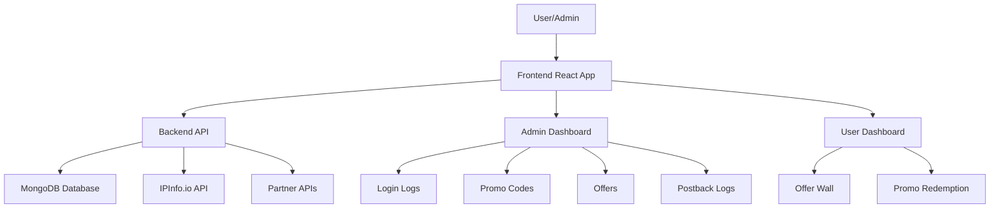

# Project Overview - Ascend Platform Enhancement

## Introduction

This document provides a comprehensive overview of the planned enhancements to the Ascend platform. The project consists of 6 major phases designed to improve functionality, data quality, and user experience.

---

## Project Goals

### Primary Objectives
1. **Enhance Data Quality**: Improve login logs with geographic information
2. **Expand Promotional Capabilities**: Add gift card functionality
3. **Fix Critical Issues**: Resolve postback parameter problems
4. **Optimize User Experience**: Clean up admin dashboard
5. **Streamline Data Models**: Remove unused offer fields
6. **Ensure Quality**: Comprehensive bug hunting and testing

### Success Metrics
- ✅ Login logs include country, city, region, ISP data
- ✅ Gift cards can be created and redeemed successfully
- ✅ Partners receive username and score in postbacks
- ✅ Admin dashboard has only necessary tabs
- ✅ Offer model contains only used fields
- ✅ Zero critical bugs in production

---

## Architecture Overview

### Technology Stack

#### Frontend
- **Framework**: React with TypeScript
- **UI Library**: Custom components with Tailwind CSS
- **State Management**: React Context API
- **Routing**: React Router
- **API Client**: Axios

#### Backend
- **Framework**: Python (Flask/FastAPI)
- **Database**: MongoDB
- **Authentication**: JWT-based
- **External APIs**: IPInfo.io for geolocation

### Key Components

---

## Phase Breakdown

### Phase 1: Login Logs Enhancement
**Priority**: High  
**Complexity**: Medium  
**Dependencies**: IPInfo.io API account

**What it does**: Enriches login logs with geographic data (country, city, region, ISP) and fixes timezone display issues.

**Impact**:
- Better fraud detection capabilities
- Improved user analytics
- Accurate timezone display

**Files Affected**:
- `backend/models/login_logs.py`
- `backend/routes/login_logs.py`
- `src/pages/AdminLoginLogs.tsx`

---

### Phase 2: Gift Card Promo Codes
**Priority**: High  
**Complexity**: Medium  
**Dependencies**: None

**What it does**: Adds ability to create gift card promo codes that directly credit user accounts.

**Impact**:
- New promotional tool for marketing
- Direct account balance crediting
- Enhanced user acquisition capabilities

**Files Affected**:
- `backend/models/promo_code.py`
- `backend/routes/admin_promo_codes.py`
- `backend/models/user.py`
- `src/pages/AdminPromoCodeManagement.tsx`

---

### Phase 3: Postback Parameter Fix
**Priority**: Critical  
**Complexity**: Low  
**Dependencies**: None

**What it does**: Ensures postbacks forwarded to partners include username and score parameters.

**Impact**:
- Partners receive complete data
- Better partner relationship management
- Improved tracking accuracy

**Files Affected**:
- `backend/routes/postback_receiver.py`
- `backend/services/partner_postback_service.py`
- `backend/routes/partners.py`
- `backend/routes/postback_logs.py`

---

### Phase 4: Admin Dashboard Cleanup
**Priority**: Medium  
**Complexity**: Low  
**Dependencies**: Stakeholder input required

**What it does**: Removes unnecessary tabs from admin dashboard.

**Impact**:
- Cleaner, more intuitive admin interface
- Reduced maintenance overhead
- Improved navigation

**Files Affected**:
- `src/components/layout/AdminSidebar.tsx`
- Various page components (TBD)
- Backend routes (TBD)

> [!WARNING]
> **Blocked**: Requires stakeholder review to identify which tabs to remove

---

### Phase 5: Offer Section Field Updates
**Priority**: Medium  
**Complexity**: Medium  
**Dependencies**: Stakeholder input required

**What it does**: Removes unused fields from offer data model.

**Impact**:
- Simplified offer management
- Reduced database storage
- Cleaner API responses

**Files Affected**:
- `backend/models/offer.py`
- `backend/routes/admin_offers.py`
- `src/pages/AdminOffers.tsx`
- `src/services/adminOfferApi.ts`

> [!WARNING]
> **Blocked**: Requires database analysis and stakeholder review

---

### Phase 6: Bug Hunting & QA
**Priority**: High  
**Complexity**: Variable  
**Dependencies**: None

**What it does**: Comprehensive testing and bug identification across the platform.

**Impact**:
- Improved platform stability
- Better user experience
- Reduced technical debt

**Testing Areas**:
- Code review
- Functional testing
- Performance testing
- Security audit
- UI/UX testing

---

## Timeline Estimate

| Phase | Estimated Duration | Status |
|-------|-------------------|--------|
| Phase 1: Login Logs | 3-5 days | 🟡 Ready to start |
| Phase 2: Gift Cards | 3-4 days | 🟡 Ready to start |
| Phase 3: Postback Fix | 1-2 days | 🟡 Ready to start |
| Phase 4: Dashboard Cleanup | 1-2 days | 🔴 Blocked - needs input |
| Phase 5: Offer Fields | 2-3 days | 🔴 Blocked - needs input |
| Phase 6: Bug Hunting | Ongoing | 🟡 Can start anytime |

**Total Estimated Time**: 10-16 working days (excluding blocked phases)

---

## Risk Management

### Technical Risks

| Risk | Impact | Mitigation |
|------|--------|------------|
| IPInfo API downtime | High | Implement caching and fallback logic |
| Database migration issues | High | Test on staging first, backup data |
| Postback breaking changes | Critical | Thorough testing with partners |
| Gift card balance errors | High | Transaction logging and validation |

### Process Risks

| Risk | Impact | Mitigation |
|------|--------|------------|
| Unclear requirements for Phase 4/5 | Medium | Schedule stakeholder meetings |
| Scope creep during bug hunting | Medium | Prioritize and document all issues |
| Testing delays | Medium | Allocate dedicated QA time |

---

## Dependencies

### External Services
- **IPInfo.io**: Geographic data provider (free tier)
  - Rate limit: 50,000 requests/month
  - Requires API key

### Internal Dependencies
- **Database Access**: MongoDB with appropriate permissions
- **Environment Variables**: Secure storage for API keys
- **Staging Environment**: For testing before production deployment

---

## Communication Plan

### Stakeholder Meetings Required
1. **Admin Dashboard Audit** (Phase 4)
   - Review current tabs
   - Identify unused features
   - Approve removal list

2. **Offer Field Analysis** (Phase 5)
   - Review current fields
   - Identify unused data
   - Approve schema changes

### Progress Updates
- Daily updates via task.md
- Weekly summary reports
- Immediate notification of blockers

---

## Success Criteria

### Phase 1: Login Logs
- ✅ All login events capture country, city, region, ISP
- ✅ Timezone display is consistent and accurate
- ✅ IPInfo API integration has <1% failure rate

### Phase 2: Gift Cards
- ✅ Admins can create gift card promo codes
- ✅ Users can redeem gift cards successfully
- ✅ Balances update correctly
- ✅ Duplicate redemptions are prevented

### Phase 3: Postback Fix
- ✅ All postbacks include username parameter
- ✅ All postbacks include score parameter
- ✅ Partners confirm receiving correct data

### Phase 4: Dashboard Cleanup
- ✅ All unused tabs removed
- ✅ Navigation works correctly
- ✅ No broken links

### Phase 5: Offer Fields
- ✅ Unused fields removed from model
- ✅ Existing offers display correctly
- ✅ New offers can be created

### Phase 6: Bug Hunting
- ✅ All critical bugs documented
- ✅ High-priority bugs fixed
- ✅ Test coverage improved

---

## Next Actions

### Immediate (This Week)
1. ✅ Create task list (`task.md`)
2. ✅ Create implementation plan (`implementation_plan.md`)
3. ✅ Create project overview (`project_overview.md`)
4. 🔲 Set up IPInfo.io account
5. 🔲 Begin Phase 1 implementation

### Short Term (Next Week)
1. 🔲 Complete Phase 1 (Login Logs)
2. 🔲 Begin Phase 2 (Gift Cards)
3. 🔲 Schedule stakeholder meetings for Phases 4 & 5

### Medium Term (Next 2 Weeks)
1. 🔲 Complete Phases 2 & 3
2. 🔲 Conduct stakeholder reviews
3. 🔲 Begin Phases 4 & 5
4. 🔲 Ongoing bug hunting

---

## Resources

### Documentation
- [Task List](file:///d:/pepeleads/ascend/lovable-ascend/documentation/task.md)
- [Implementation Plan](file:///d:/pepeleads/ascend/lovable-ascend/documentation/implementation_plan.md)
- [API Documentation](file:///d:/pepeleads/ascend/lovable-ascend/documentation/API.md)

### External Resources
- [IPInfo.io Documentation](https://ipinfo.io/developers)
- [MongoDB Documentation](https://docs.mongodb.com/)

---

**Document Version**: 1.0  
**Last Updated**: 2025-12-19  
**Status**: Planning Complete
